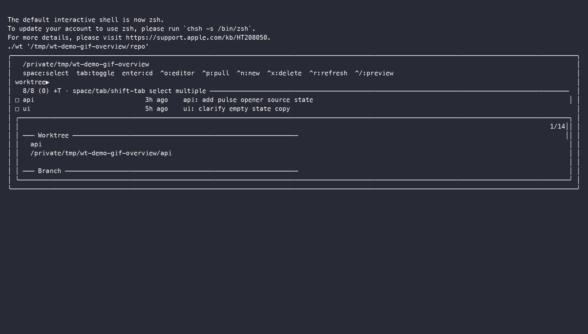
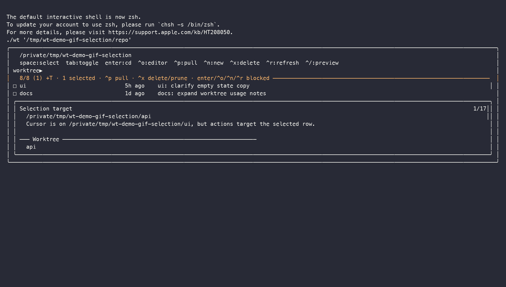
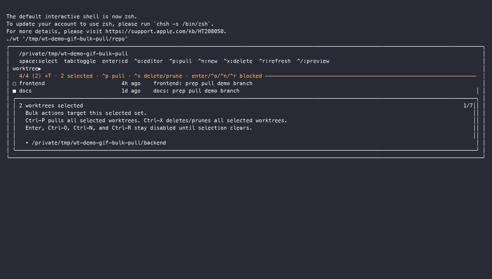
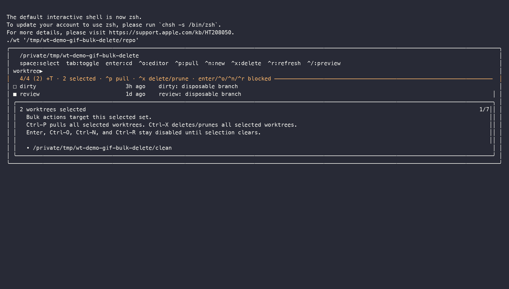

# wt — Interactive Git Worktree Dashboard

Browse, manage, and jump between Git worktrees from a keyboard-driven `fzf`
dashboard.

`wt` is a standalone Bash tool for macOS, Linux, and WSL. It opens quickly,
shows rich preview data on demand, and now treats multi-selection as a
first-class workflow.

## Features

- Fast worktree browser built on `git worktree list --porcelain`
- Always-on multi-selection with `Space`, `Tab`, and `Shift-Tab`
- Rich preview with branch, activity, submodule, and working-tree details
- Bulk-safe actions for pull and delete/prune
- Shell wrapper support so `Enter` can `cd` directly into the chosen worktree
- Homebrew install support

## Install

### Homebrew

```bash
brew install ashwch/tap/wt
```

### Manual

```bash
# dependencies
brew install git fzf

# clone
git clone https://github.com/ashwch/wt.git
cd wt

# put wt on PATH
mkdir -p "$HOME/.local/bin"
ln -sf "$PWD/wt" "$HOME/.local/bin/wt"
```

## Usage

```bash
wt                  # auto-detect repo from $PWD
wt /path/to/repo    # explicit repo path
wt -h               # help
wt --version        # version
```

### Shell Integration

If you want `Enter` to change your shell directory instead of only printing the
chosen path, source the wrapper for your shell:

```zsh
# zsh
source ~/path/to/wt/share/wt/wt.zsh
```

```bash
# bash
source ~/path/to/wt/share/wt/wt.bash
```

## Demo

GitHub renders animated GIFs reliably, so the README uses GIF previews first.
The matching asciinema casts are kept in the repo as the higher-fidelity,
terminal-native source demos for local replay.

Read this section as:

- `.cast` files are the source-of-truth demos
- `.gif` files are GitHub-friendly derivatives for inline README playback

### Overview



Shows:
- browsing a richer worktree set
- varied commit ages and preview states
- the default dashboard flow before selection starts

Replay locally:

```bash
asciinema play docs/assets/wt-demo-overview.cast
```

### Multi-Selection



Shows:
- always-on multi-selection with `Tab`
- visible `□` / `■` row state cells
- off-target preview behavior and the bulk-target summary

Replay locally:

```bash
asciinema play docs/assets/wt-demo-selection.cast
```

### Bulk Pull



Shows:
- selecting multiple worktrees
- running `Ctrl-P` against the selected set
- the dashboard returning to the updated list afterward

Replay locally:

```bash
asciinema play docs/assets/wt-demo-bulk-pull.cast
```

### Bulk Delete



Shows:
- selecting multiple worktrees
- opening the bulk delete confirmation flow with `Ctrl-X`
- stepping through the delete path in a disposable demo repo

Replay locally:

```bash
asciinema play docs/assets/wt-demo-bulk-delete.cast
```

For convenience, the overview cast is also copied to:

```text
docs/assets/wt-demo.cast
```

Regenerate the demo suite:

```bash
./scripts/record-demo-cast.sh all
./scripts/render-demo-gifs.sh all
```

Both scripts also support individual modes:

```bash
./scripts/record-demo-cast.sh overview
./scripts/record-demo-cast.sh selection
./scripts/record-demo-cast.sh bulk-pull
./scripts/record-demo-cast.sh bulk-delete

./scripts/render-demo-gifs.sh overview
./scripts/render-demo-gifs.sh selection
./scripts/render-demo-gifs.sh bulk-pull
./scripts/render-demo-gifs.sh bulk-delete
```

Demo-generation requirements:

- casts: `git`, `tmux`, `asciinema`
- GIFs: `ffmpeg`, `python3`

The GIF renderer bootstraps a temporary Python venv with Pillow automatically,
so you do not need to vendor image tooling into the repo itself.

## Keybindings

Multi-selection is always on. The dashboard starts in the familiar
zero-selection mode, but the moment anything is selected it becomes
selection-targeted.

| Key | Action |
|------|---------|
| `Space` | Toggle selection when the query is empty |
| `Tab` / `Shift-Tab` | Toggle selection and move |
| `Enter` | cd into the focused worktree when no selection is active |
| `Ctrl-O` | Open the focused worktree in `$EDITOR` when no selection is active |
| `Ctrl-P` | Pull the focused worktree or all selected worktrees |
| `Ctrl-N` | Create a new worktree from the focused row when no selection is active |
| `Ctrl-X` | Delete/prune the focused worktree or all selected worktrees |
| `Ctrl-R` | Refresh the list when no selection is active |
| `Ctrl-/` | Toggle preview panel |

The left state column uses a single glyph language:

- `□` ordinary row
- `■` selected row

Focus is shown by the normal row highlight, not by an extra symbol.

## Requirements

- `git`
- `fzf` with `--id-nth` and `--info-command` support
- `bash`

## More Docs

The README is intentionally short. The deeper notes moved here:

- [docs/DEVELOPMENT.md](docs/DEVELOPMENT.md)
  Why the list/preview/selection model works the way it does, plus maintainer commands and demo-asset generation notes.
- [docs/DELETE_MODEL.md](docs/DELETE_MODEL.md)
  Delete/prune behavior, stale worktree handling, and troubleshooting.
- [CHANGELOG.md](CHANGELOG.md)
  Release notes.

## License

MIT
